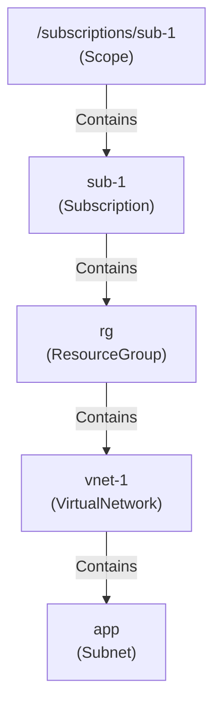

# Radivum — Mermaid Topology

- **Graph schema:** 1.0
- **Source snapshot schema:** 0.1
- **Scope:** /subscriptions/sub-1

```mermaid
flowchart TB
    N0001["vnet-1\n(VirtualNetwork)"]
    N0002["app\n(Subnet)"]
    N0003["rg\n(ResourceGroup)"]
    N0004["/subscriptions/sub-1\n(Scope)"]
    N0005["sub-1\n(Subscription)"]
    N0001 -->|Contains| N0002
    N0003 -->|Contains| N0001
    N0004 -->|Contains| N0005
    N0005 -->|Contains| N0003
```
